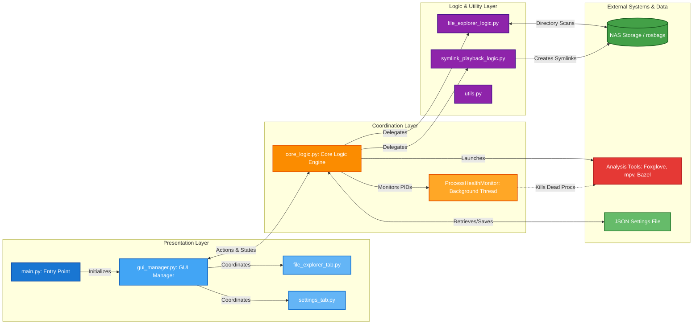

```mermaid
graph LR
    %% Layer 1: Presentation Layer (UI)
    subgraph UI_Layer [Presentation Layer]
        Main[main.py: Entry Point]
        GM[gui_manager.py: GUI Manager]
        FET[file_explorer_tab.py]
        ST[settings_tab.py]
    end

    %% Layer 2: Orchestration Layer (Core)
    subgraph Core_Layer [Coordination Layer]
        CL[core_logic.py: Core Logic Engine]
        PHM[ProcessHealthMonitor: Background Thread]
    end

    %% Layer 3: Logic & Utility Layer (Back-end)
    subgraph Logic_Layer [Logic & Utility Layer]
        FEL[file_explorer_logic.py]
        SPL[symlink_playback_logic.py]
        UTL[utils.py]
    end

    %% Layer 4: External Systems
    subgraph External_Systems [External Systems & Data]
        NAS[(NAS Storage / rosbags)]
        Tools[Analysis Tools: Foxglove, mpv, Bazel]
        Config[JSON Settings File]
    end

    %% Relationships and Data Flow
    Main -->|Initializes| GM
    GM -->|Coordinates| FET
    GM -->|Coordinates| ST
    GM <-->|Actions & States| CL

    CL <-->|Retrieves/Saves| Config
    CL -->|Delegates| FEL
    CL -->|Delegates| SPL
    CL -->|Monitors PIDs| PHM

    FEL <-->|Directory Scans| NAS
    SPL -->|Creates Symlinks| NAS
    CL -->|Launches| Tools
    PHM -.->|Kills Dead Procs| Tools

    %% Color Coding for Individual Boxes
    %% Presentation Layer - Blue shades
    style Main fill:#1976D2,stroke:#0D47A1,stroke-width:2px,color:#fff
    style GM fill:#42A5F5,stroke:#1565C0,stroke-width:2px,color:#fff
    style FET fill:#64B5F6,stroke:#1976D2,stroke-width:2px,color:#fff
    style ST fill:#64B5F6,stroke:#1976D2,stroke-width:2px,color:#fff

    %% Coordination Layer - Orange/Yellow shades
    style CL fill:#FB8C00,stroke:#E65100,stroke-width:2px,color:#fff
    style PHM fill:#FFA726,stroke:#E65100,stroke-width:2px,color:#fff

    %% Logic & Utility Layer - Purple shades
    style FEL fill:#8E24AA,stroke:#4A148C,stroke-width:2px,color:#fff
    style SPL fill:#8E24AA,stroke:#4A148C,stroke-width:2px,color:#fff
    style UTL fill:#8E24AA,stroke:#4A148C,stroke-width:2px,color:#fff

    %% External Systems - Red/Green shades
    style NAS fill:#43A047,stroke:#1B5E20,stroke-width:2px,color:#fff
    style Tools fill:#E53935,stroke:#B71C1C,stroke-width:2px,color:#fff
    style Config fill:#66BB6A,stroke:#2E7D32,stroke-width:2px,color:#fff
```
