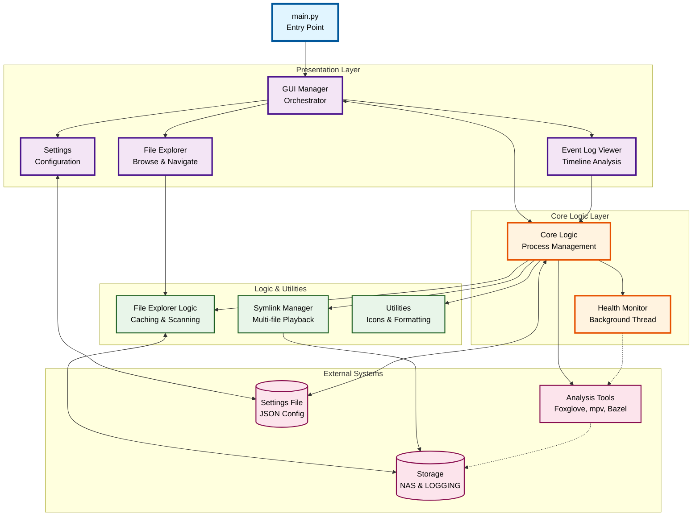

## 📋 Architecture Summary

### **4-Layer Architecture**

**1. Presentation Layer**
- GUI Manager orchestrates all UI components
- File Explorer for browsing and navigation
- Event Log Viewer for timeline analysis
- Settings for configuration management

**2. Core Logic Layer**
- Process lifecycle management
- External tool launching (Foxglove, mpv, Bazel)
- Background health monitoring thread

**3. Logic & Utilities**
- File operations with caching (1000 entries)
- Multi-file symlink management
- Icon mapping and formatting utilities

**4. External Systems**
- Storage: NAS and LOGGING drives
- Analysis Tools: Foxglove, mpv, Bazel
- Settings: JSON configuration file

---

## 🔄 Key Workflows

| Workflow | Flow |
|----------|------|
| **File Playback** | User selects files → File Explorer → Core Logic → Launch Tools |
| **Event Analysis** | Open event log → Select timestamp → Launch video/rosbag at exact time |
| **Configuration** | Edit settings → Save to JSON → Callbacks update UI |
| **Process Management** | Health monitor checks every 10s → Clean up dead processes |

---

## 🚀 Key Features

- **Smart Caching**: 1000-entry file cache for fast navigation
- **Health Monitoring**: Automatic process cleanup every 10 seconds
- **Multi-file Support**: Symlink-based batch rosbag playback
- **Link Parsing**: Supports Foxglove, mpv, and Bazel command formats
- **NAS Detection**: Automatic connection monitoring and warnings
